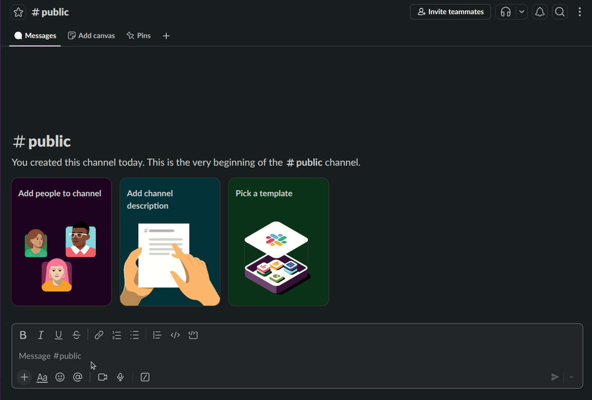

# slack-order

Slack app using [Bolt for Python] to collect and consolidate user order information.

[Bolt for Python]: https://github.com/slackapi/bolt-python

## Demo

## Document

[link](https://wcya.github.io/hugo-papermod-blog/en/posts/slack/slack-order/)
